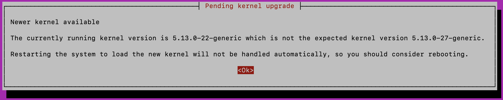
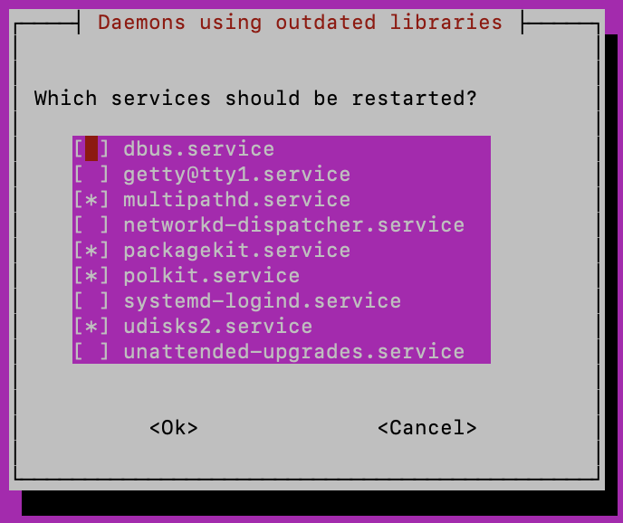
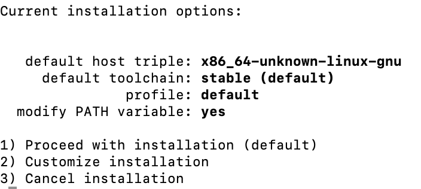
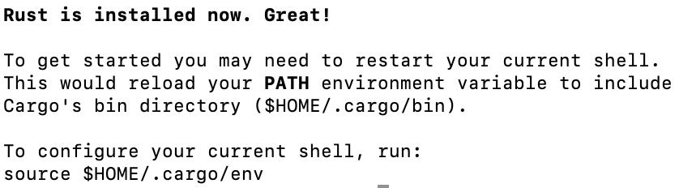
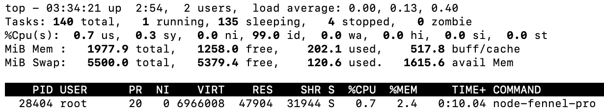
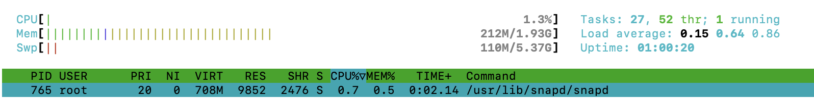
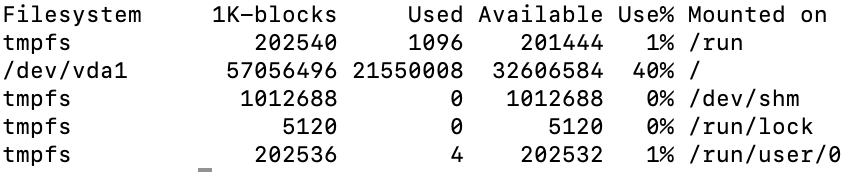

# Build a Fennel Protocol Node

The following guide is a simple set of instructions regarding how to build and run a Fennel Protocol node. These instructions assume the reader knows their way around a command-line Linux distribution, such as Ubuntu, and additionally has access to a cloud provider in order to quickly launch a low cost server.

First, you may want to spin up an Ubuntu instance. In the course of writing this document, the following configurations were tested:

**Operating System**

- Ubuntu 20.x
- Ubuntu 21.x

**Hardware**

- 1 CPU / 2 GM RAM / 55 GB SSD
- 2 CPU / 4 GB RAM / 80 GB SSD
- 4 CPU / 8 GB RAM / 160 GB SSD

Bear in mind, regardless of the OS or hardware configuration, the facet one might want to focus on the most would be disk space. Over time, a node operator should expect the blockchain to accumulate a large number of transactions and thus take up space on a deployed instance. Of course, throwing more hardware at anything will improve performance and compile time of the initial build, but disk space will likely be the first issue that will have to be addressed if adequate planning for growth is not factored in.

Assuming a compute instance has been instantiated, and the user has has done all of the miscelleneous things required to secure the operating system, the following series of commands below will prepare an Ubuntu-based Linux distribution to compile and run a Fennel Protocol node.

## Update the System

---

First, update the OS and install a necessary library.

`sudo apt update && sudo apt upgrade -y`

`apt install libclang-dev`

After the previous command, you may get the following screens on certain Ubuntu versions. Press "Enter" on your keyboard and proceed through both screens.

Then, to avoid errors, you will need to reboot.

`reboot now`

After your system reboots, log back in and continue with the following command.

`apt install build-essential`

## Install Rust and Associated Libraries

---

At this point, your system has some necessary libraries installed and your instance should be fully updated. Now we will focus on the particulars of installing Rust.

`curl --proto '=https' --tlsv1.2 -sSf https://sh.rustup.rs | sh`

If you get the following screen, choose option 1.

After Rust completes its installation, you will likely get this screen:

Follow the instructions and refresh environment.

`source $HOME/.cargo/env`

Continue by setting the nightly Rust build as your default and add the necessary toolchain.

`rustup default nightly`

`rustup target add wasm32-unknown-unknown --toolchain nightly`

## Build and Launch a Fennel Protocol Node

---

Find a place to clone the repository that you will need to comple, then clone the Fennel Protocol repository.

`git clone https://github.com/fennelLabs/Fennel-Protocol.git`

Ensure you are within the directory where the repository was clone, then run the following commands.

`git submodule init`

`git submodule update`

Then finally, compile and launch the node.

`cargo run --release -- --dev --tmp`

You will know your work is done when the following screen appears.

## Resource Utilization

---

Below are some screen captures to show resource utilizaiton for the lowest cost instance we tested (1 CPU / 2 GM RAM / 55 GB SSD). 

# Interacting with the Chain
Once the node is running locally, you can connect to it from your browser with the **Polkadot-JS Apps** [front-end](https://polkadot.js.org/apps/#/explorer?rpc=ws://localhost:9944). This will open an interface exposing features for account management, staking, governance, and most importantly extrinsics calls. These are implementations of Fennel Protocol's core functionality, and might be considered similar to smart contract functions or API endpoints.

The extrinsics included in Fennel Protocol are outlined along with scripts used to streamline testing the protocol at [Fennel Protocol wiki](https://github.com/fennelLabs/Fennel-Protocol/wiki/Testing-Milestone-1).
